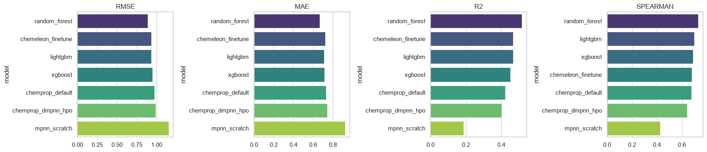
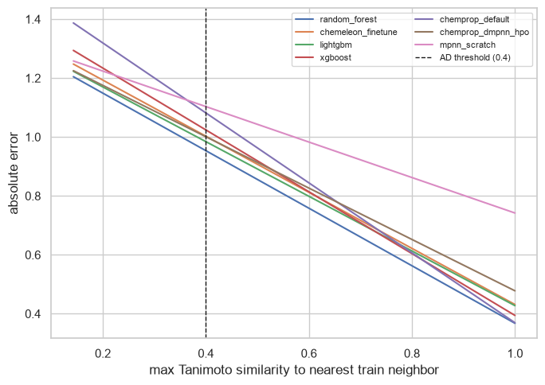
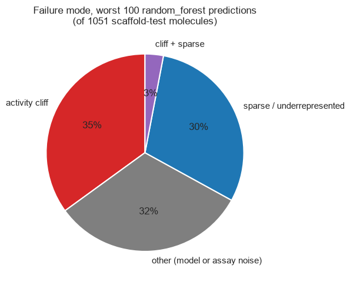

# EGFR pIC50 Prediction

**Live demo:** [pic50prediction.streamlit.app](https://pic50prediction.streamlit.app/)

This project predicts EGFR kinase binding affinity, expressed as pIC50 (pIC50 = −log₁₀(IC50 in molar)), directly from molecular structure. The dataset is sourced from ChEMBL target ([`CHEMBL203`](https://www.ebi.ac.uk/chembl/target_report_card/CHEMBL203/)).

Three modeling approaches are trained and evaluated on the same scaffold-disjoint dataset using a consistent evaluation protocol. Beyond reporting predictive performance, the workflow also estimates the applicability domain and provides an uncertainty interval for every prediction, giving a more realistic assessment of model reliability rather than relying solely on a single leaderboard metric.


## 1. Introduction

Drug discovery is a slow and costly process, with a significant portion of the expense associated with synthesizing and experimentally testing compounds that ultimately show little or no activity. QSAR (quantitative structure–activity relationship) models can help reduce this burden by computationally ranking thousands of candidate molecules before they are synthesized, allowing medicinal chemists to prioritize compounds with the greatest potential for further experimental evaluation [1, 2].

pIC50 is widely used as a regression target for modeling compound potency. It is derived from the IC50 value using a logarithmic transformation, which reduces the strong skew and large dynamic range typically observed in raw IC50 measurements. As a result, pIC50 provides a more suitable scale for regression modeling, where a one-unit difference corresponds to an approximately tenfold difference in potency.

EGFR is a well-established oncology target whose activating mutations and other alterations play an important role in a substantial subset of non-small-cell lung cancers. In addition, the availability of a large publicly accessible collection of EGFR activity data in ChEMBL makes it a suitable and reproducible benchmark for developing and comparing QSAR modeling approaches [3, 4].


## 2. Data

Bioactivity data was pulled from ChEMBL [3] for target `CHEMBL203`: binding assays only, exact IC50 measurements in nM, human EGFR. Curation (`src/components/data_loader.py`) removes missing/invalid values, an ambiguous 1,000–10,000 nM "intermediate activity" zone, standardizes SMILES (desalting, canonicalization via RDKit [5]), drops inorganic and fragment-like molecules, and deduplicates repeat measurements to a mean pIC50.

| Step | Records |
|---|---:|
| ChEMBL fetch (binding, IC50, nM, exact, human) | 18,381 |
| After missing/range/dedup filtering | 10,520 |
| After SMILES standardization + validation | **10,502** |

**Final dataset:** 10,502 compounds, pIC50 range 2.19–11.52 (median 7.06), 75.3% "active" (pIC50 ≥ 6).

**Splitting** (`scripts/make_splits.py`): the primary split is a Bemis-Murcko **scaffold split** [6], greedily assigning whole scaffold groups to train/val/test so no scaffold leaks across splits. It's the realistic test of generalization to structurally novel chemistry that a prospective screen actually faces. A random split is generated only for contrast. Both are 80/10/10 (8,401 / 1,050 / 1,051 compounds). The dataset is chemically diverse: 3,854 unique scaffolds, 67% of which are singletons, and every one of the 1,051 scaffold-split test molecules has a scaffold not shared with any other test molecule.

## 3. Models

| Track | Representation | Uncertainty | Notes |
|---|---|---|---|
| Random Forest, XGBoost, LightGBM | ECFP4 fingerprints + RDKit descriptors | Split-conformal intervals (MAPIE) [7] | `RandomizedSearchCV`, 5-fold scaffold-grouped CV |
| MPNN (from scratch) | Molecular graph, custom features | MC-dropout, 30 passes [8] | 3-layer message-passing net on PyTorch Geometric [9], following Gilmer et al. [10] |
| Chemprop D-MPNN (default + tuned) | Learned graph representation | Mean-variance estimation | Hyperparameters tuned via Ray Tune + Optuna (30 trials) on a GCP GPU VM [11] |
| CheMeleon fine-tune | Learned graph, pretrained init | Mean-variance estimation | D-MPNN initialized from CheMeleon (~1M PubChem molecules), fine-tuned on the same GCP GPU VM [12] |

Every run logs split type, descriptor type, hyperparameters, seed, and val/test metrics to Weights & Biases, with the best model per class registered to the model registry [13].

## 4. Results

Scaffold-split test set, all seven models evaluated on the same never-trained-on compounds:



| Model | RMSE ↓ | MAE ↓ | R² ↑ | Spearman ρ ↑ |
|---|---:|---:|---:|---:|
| **Random Forest** | **0.889** | **0.666** | **0.516** | **0.733** |
| CheMeleon fine-tune | 0.934 | 0.722 | 0.467 | 0.682 |
| LightGBM | 0.934 | 0.711 | 0.467 | 0.700 |
| XGBoost | 0.947 | 0.715 | 0.451 | 0.691 |
| Chemprop D-MPNN (default) | 0.972 | 0.732 | 0.422 | 0.676 |
| Chemprop D-MPNN (tuned) | 0.989 | 0.744 | 0.402 | 0.643 |
| MPNN (from scratch) | 1.155 | 0.927 | 0.185 | 0.419 |

A classical Random Forest on fixed fingerprints beats every graph-based model, including a foundation-model fine-tune. A few things worth noting:

- **Pretraining helps but doesn't close the gap.** CheMeleon's fine-tune ties LightGBM, well ahead of the untuned D-MPNN, but still trails Random Forest.
- **Tuning the D-MPNN didn't help.** The 30-trial Ray Tune search finished *worse* than chemprop's defaults, likely because a 5-parameter search on a ~1,050-molecule validation set is well within the noise floor: it's easy to fit the validation split rather than find something that generalizes.
- **Scaffold split matters.** The same Random Forest scores RMSE 0.764 on a random split, about 14% more optimistic than the 0.889 scaffold-split number, purely from letting near-duplicate scaffolds leak between train and test. Every headline number here uses the scaffold split for that reason.

## 5. Error analysis

Every test molecule's Tanimoto similarity to its nearest training neighbor is checked; below the 0.4 threshold, predictions are flagged as out of the applicability domain, not rejected [14]. 90% of the test set is in-domain, and mean error is consistently higher outside it, for every model, as expected:



Every model's error rises as similarity to the nearest training compound drops, which is the reassuring result: each is extrapolating worse exactly where it should be trusted less. The from-scratch MPNN (pink) is the one outlier, with a flatter slope, not because it generalizes better out of domain, but because its error is already high even in-domain, so it has less to lose venturing further out.

The more interesting question is *why* models failed to predict pIC50 for some molecules. Two failure modes look identical in an error table but need different fixes [14, 15]: sparse chemistry (few training analogs, more data would help) and activity cliffs (a near-identical training analog exists but its measured potency is very different, which a fingerprint-similarity model is poorly suited to catch by construction). Correlating absolute error against nearest-neighbor diagnostics, the activity-cliff metrics (Δ pIC50 to nearest neighbor, ρ = +0.47; SALI score, ρ = +0.32) track error far more than representation/sparsity metrics (ρ = −0.16 to −0.27), meaning cliffs tend to produce the *worst* individual errors even where they aren't the most common cause:



An analysis of the 100 worst-predicted molecules shows that **activity cliffs are the largest error category, accounting for 35% of the cases**, followed by sparse chemistry (30%) and cases that do not fit either category (32%), which may reflect assay noise, data quality issues, or mislabeling. Although activity cliffs represent the largest single category, they do not constitute a majority of the errors. Combined with the correlation result above, this suggests that a substantial fraction of the model’s largest errors may not be resolved simply by adding more training data of the same type. Instead, addressing these errors may require better representation of local structure–activity relationships, improved data quality, or explicit treatment of uncertainty and activity-cliff behavior.


## 6. Conclusion

On this dataset (10,502 compounds, 8,401 for training), classical ML beat every graph-based model tested, including a fine-tune from a foundation model pretrained on ~1,000x more molecules than this target has data for. **Classical ML is powerful and underrated at this scale**: ECFP fingerprints and RDKit descriptors already encode a lot of medicinal-chemistry domain knowledge about molecular similarity, so a tree ensemble only has to learn how to weight that prior, not build it from nothing.

**GNNs and the Chemprop D-MPNN are comparatively data-hungry.** The from-scratch MPNN, with every weight learned only from ~8,400 EGFR-specific examples, was the weakest model here. Pretraining (CheMeleon) closes most, not all, of that gap, and hyperparameter tuning on a dataset this size wasn't a reliable. None of that means graph-based methods are the wrong tool in general; it means they need either considerably more labeled data or a broader transfer story before they reliably beat a well-tuned classical baseline at single-target, thousands-of-compounds scale [16]. Whichever model is deployed, roughly half of its worst errors are activity cliffs that more data alone won't fix, which is exactly why every prediction from this project ships with an uncertainty interval and an applicability domain flag rather than a bare number.

## 7. Future directions

Based on the findings in Section 5, four concrete improvement strategies stand out, ranked in the order they are most likely to deliver the greatest impact:


- **Deeper data curation.** The pchembl_value disagreement flag (Section 2) currently just marks rows for review; closing the loop, manually re-verifying flagged assays, adding PAINS/structural-alert filtering, and cross-referencing consensus values across databases, would directly shrink the "other / unexplained" 32% of worst errors, some of which is likely assay noise or mislabeling rather than a modeling problem at all.
- **More data.** The clearest opportunity for the data-hungry modeling approaches discussed in Section 6 is to expand the training set by incorporating BindingDB and additional ChEMBL activity measurements beyond exact-relation IC50 values. These data should be integrated using appropriate handling of activity relations and assay heterogeneity rather than being discarded.
- **Multitask learning.** Jointly training on related ErbB-family kinases (HER2, HER3, HER4) and other EGFR assay types (Ki, EC50) would let the D-MPNN and CheMeleon tracks share representation across targets, which is plausibly the "broader transfer story" this dataset alone can't give them (Section 6).
- **Activity-cliff-aware modeling.** Since cliffs are the single largest failure category (35% of the worst 100 errors, Section 5) and are hard for a similarity-based model *by construction*, this needs a dedicated fix, matched molecular pair (MMP) analysis to explicitly surface known cliffs, cliff-aware sample weighting or loss terms, or a pairwise/siamese architecture trained directly on Δ-activity between similar pairs.


## 8. Repository structure

| Path | Contents |
|---|---|
| `data/` | ChEMBL downloads, curated dataset, train/val/test splits |
| `notebooks/` | `01` data curation → `02` EDA → `03` classical ML → `04` GNN → `05` Chemprop/CheMeleon → `06` model comparison & error analysis |
| `scripts/` | CLI entry points: data splitting, training the GNN/Chemprop/CheMeleon tracks, Chemprop hyperparameter search, GCP GPU VM setup |
| `src/components/` | Data loading & curation, featurization, GNN architecture, model training, evaluation & applicability domain |
| `src/pipeline/` | `predict_pipeline.py`, the shared inference pipeline behind the web app (`api/` and `app.py` both import `PredictionPipeline`) |
| `api/` | FastAPI backend: `/predict/single`, `/predict/batch`, `/health` |
| `app.py` | Streamlit UI (single molecule and batch prediction) |
| `docker/` | Dockerfiles for the API, the Streamlit app, and Hugging Face Spaces |
| `configs/` | `config.yaml`: paths, hyperparameters, experiment settings |
| `results/` | Metrics tables and figures backing Sections 4-5 |
| `models/` | Saved model artifacts (gitignored) |

## 9. Setup & reproducing

```bash
conda env create -f environment.yml    # RDKit must come from conda-forge, not pip
conda activate egfr-env
python scripts/make_splits.py          # build scaffold + random splits
jupyter notebook notebooks/01_data_curation.ipynb
```

Classical ML and the from-scratch GNN run end to end. Chemprop and CheMeleon are GPU-heavy and meant to run as scripts on a training box (`scripts/gcp_setup.sh` bootstraps a GCP GPU VM):

```bash
python scripts/hpopt_chemprop.py --accelerator gpu
python scripts/train_chemprop.py --accelerator gpu --config-path models/chemprop/hpopt/scaffold/best_config.toml
python scripts/finetune_chemeleon.py --accelerator gpu --epochs 30
```


```bash
streamlit run app.py                              # UI, predicts in-process
uvicorn api.main:app --reload --port 8000          # backend, optional
docker-compose up                                  # both, in containers
```

## References

[1] Vamathevan, J. et al. "Applications of machine learning in drug discovery and development." *Nature Reviews Drug Discovery* 18, 463-477 (2019).
[2] Chen, H. et al. "The rise of deep learning in drug discovery." *Drug Discovery Today* 23(6), 1241-1250 (2018).
[3] Gaulton, A. et al. "ChEMBL: a large-scale bioactivity database for drug discovery." *Nucleic Acids Research* 40(D1), D1100-D1107 (2012).
[4] Sharma, S. V. et al. "Epidermal growth factor receptor mutations in lung cancer." *Nature Reviews Cancer* 7, 169-181 (2007).
[5] RDKit: Open-source cheminformatics. [rdkit.org](https://www.rdkit.org)
[6] Bemis, G. W.; Murcko, M. A. "The Properties of Known Drugs. 1. Molecular Frameworks." *J. Med. Chem.* 39(15), 2887-2893 (1996).
[7] Taquet, V. et al. "MAPIE: an open-source library for distribution-free uncertainty quantification." *arXiv:2207.12274* (2022).
[8] Gal, Y.; Ghahramani, Z. "Dropout as a Bayesian Approximation." *ICML* (2016).
[9] Fey, M.; Lenssen, J. E. "Fast Graph Representation Learning with PyTorch Geometric." *ICLR-W* (2019).
[10] Gilmer, J. et al. "Neural Message Passing for Quantum Chemistry." *ICML* (2017).
[11] Heid, E. et al. "Chemprop: A Machine Learning Package for Chemical Property Prediction." *J. Chem. Inf. Model.* 64(1), 9-17 (2024).
[12] CheMeleon: Chemprop foundation-model checkpoint pretrained on ~1M PubChem molecules. [github.com/chemprop/chemprop](https://github.com/chemprop/chemprop)
[13] Biewald, L. "Experiment Tracking with Weights and Biases." (2020).
[14] Sheridan, R. P. et al. "Similarity to Molecules in the Training Set Is a Good Discriminator for Prediction Accuracy in QSAR." *J. Chem. Inf. Comput. Sci.* 44(6), 1912-1928 (2004).
[15] Guha, R.; Van Drie, J. H. "Structure-Activity Landscape Index: Identifying and Quantifying Activity Cliffs." *J. Chem. Inf. Model.* 48(3), 646-658 (2008).
[16] Jiang, D. et al. "Could graph neural networks learn better molecular representation for drug discovery?" *J. Cheminform.* 13, 12 (2021).
